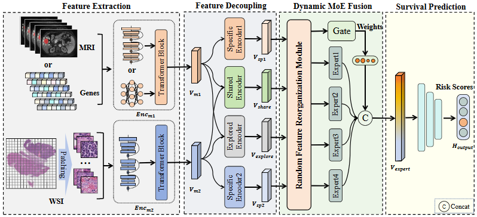

# DeReF
- [x] 2025-08-27 ⭐: Initial release of DeReF model on arxiv preprint
- [x] 2026-02-23 ⭐: Congratulations! 🎉🎊🎉 DeReF has been accepted by TMI 2026 🎯

<summary>
  <b>Decouple, Reorganize, and Fuse: A Multimodal Framework for Cancer Survival Prediction</b>.
  <a href="https://ieeexplore.ieee.org/document/11417210" target="blank">[TMI Early Access]</a> 
  <br><em>Huayi Wang, Haochao Ying, Yuyang Xu, Qibo Qiu, Cheng Zhang, Danny Z. Chen, Ying Sun, and Jian Wu </em></br>
</summary>

```bash
@ARTICLE{11417210,
  author={Wang, Huayi and Ying, Haochao and Xu, Yuyang and Qiu, Qibo and Zhang, Cheng and Chen, Danny Z. and Sun, Ying and Wu, Jian},
  journal={IEEE Transactions on Medical Imaging}, 
  title={Decouple, Reorganize, and Fuse: A Multimodal Framework for Cancer Survival Prediction}, 
  year={2026},
  keywords={Cancer survival prediction;Modal decoupling;Multimodal fusion;Mixture-of-Experts},
  doi={10.1109/TMI.2026.3668773}}
```
</details>

**Summary:** Here is the official implementation of the paper "Decouple, Reorganize, and Fuse: A Multimodal Framework for Cancer Survival Prediction".




### Pre-requisites:
```bash
torch 2.3.1+cu121
scikit-survival 0.23.0
```

### Prepare your data
#### WSIs
1. Download diagnostic WSIs from [TCGA](https://portal.gdc.cancer.gov/)
2. Use the WSI processing tool provided by [CLAM](https://github.com/mahmoodlab/CLAM) to extract resnet-50 pretrained 1024-dim feature for each 256 $\times$ 256 patch (20x), which we then save as `.pt` files for each WSI. So, we get one `pt_files` folder storing `.pt` files for all WSIs of one study.

The final structure of datasets should be as following:
```bash
DATA_ROOT_DIR/
    └──pt_files/
        ├── slide_1.pt
        ├── slide_2.pt
        └── ...
```

DATA_ROOT_DIR is the base directory of cancer type (e.g. the directory to TCGA_BLCA), which should be passed to the model with the argument `--data_root_dir` as shown in [run1.sh](run1.sh).

#### Genomics
In this work, we directly use the preprocessed genomic data provided by [PORPOISE](https://github.com/mahmoodlab/PORPOISE), stored in folder [csv](./csv).

## Training-Validation Splits
Splits for each cancer type are found in the `splits/5foldcv ` folder, which are randomly partitioned each dataset using 5-fold cross-validation. Each one contains splits_{k}.csv for k = 1 to 5. 

## Running Experiments
To train DeReF, you can specify the argument in the bash `run1.sh` and run the command:
```bash
bash run1.sh
```
or use the following generic command-line and specify the arguments:
```bash
CUDA_VISIBLE_DEVICES=<DEVICE_ID> python main.py \
                                      --which_splits 5foldcv \
                                      --dataset <CANCER_TYPE> \
                                      --data_root_dir <DATA_ROOT_DIR>\
                                      --modal coattn \
                                      --model DeReF \
                                      --num_epoch 30 \
                                      --batch_size 1 \
                                      --loss nll_surv_mse \
                                      --lr 0.0005 \
                                      --optimizer Adam \
                                      --scheduler None \
                                      --alpha 1.0
```
Commands for all experiments of DeReF can be found in the [run1.sh](run1.sh) file.


## Acknowledgements
Huge thanks to the authors of following open-source projects:
- [CLAM](https://github.com/mahmoodlab/CLAM)

## License & Citation 
If you find our work useful in your research, please consider citing our paper at:
```bash
@ARTICLE{11417210,
  author={Wang, Huayi and Ying, Haochao and Xu, Yuyang and Qiu, Qibo and Zhang, Cheng and Chen, Danny Z. and Sun, Ying and Wu, Jian},
  journal={IEEE Transactions on Medical Imaging}, 
  title={Decouple, Reorganize, and Fuse: A Multimodal Framework for Cancer Survival Prediction}, 
  year={2026},
  keywords={Cancer survival prediction;Modal decoupling;Multimodal fusion;Mixture-of-Experts},
  doi={10.1109/TMI.2026.3668773}}

